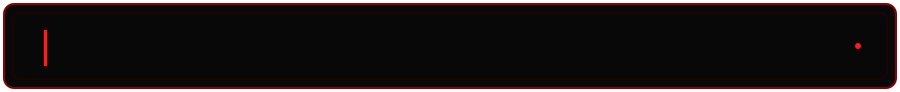

<div align="center">



<br>

# **malj0y**

### **Security Engineer by day. Red Team Operator by night.**

`OFFENSIVE SECURITY` · `ADVERSARY SIMULATION` · `MALWARE DEVELOPMENT` · `AI RED TEAMING` · `VULNERABILITY RESEARCH`

<br>

```text
[+] Breaking assumptions
[+] Building offensive tooling
[+] Studying adversary tradecraft
[+] Turning ideas into code
[+] Occasionally making that code behave suspiciously
```

</div>


## `> cat about_me.txt`

I'm a **Security Engineer** with a strong interest in the offensive side of security.

During the day, I work on security engineering problems.

After hours, things get a little more adversarial.

I spend my time experimenting with **Red Team tradecraft**, developing offensive tooling, researching malware techniques, hunting vulnerabilities, and writing code to understand how systems behave when someone deliberately pushes them outside their intended boundaries.

A lot of my work starts with a simple question:

> **"What happens if I make this behave a little more like malware?"**

Then I build it, break it, instrument it, test it in controlled environments, learn from it, and usually come back with several more questions.


## `> ls interests/`

| Domain | Focus |
|---|---|
| ⚔️ **Red Team Operations** | Adversary Simulation · Active Directory · Initial Access · Post-Exploitation · Offensive Tooling |
| 🧬 **Malware Research** | Malware Development · Windows Internals · Evasion Research · Payload Engineering · Implant Development |
| ⚙️ **Offensive Development** | Rust · Go · C · C++ · Nim · Assembly |
| 🔬 **Vulnerability Research** | Bug Bounty Hunting · Web Security · Exploit Development · Attack Surface Research |
| 🤖 **AI Red Teaming** | Adversarial AI · LLM Security · AI-Assisted Offensive Security |
| 🧪 **Research** | "What happens if we try this?" |


## `> ./current_operation`

### Building my own Command & Control Framework

One of the areas I'm currently exploring is the design and development of a **Command & Control framework** for my own research and authorized Red Team use cases.

The project gives me an excuse to dig deeper into things I enjoy:

- agent and server architecture
- communications design
- operator workflows
- offensive systems programming
- Windows internals
- payload engineering
- memory and process internals
- operational security considerations
- detection and evasion research
- adversary emulation
- low-level systems programming
- cross-language offensive tooling

For me, building offensive tooling isn't only about producing a tool.

It's about understanding the systems underneath it.


<div align="center">

### **Build. Break. Research. Repeat.**

*"Malware & Exploits are the programmatic expression of my will, I live for this shit."*

</div>

---

> **Note:** Security research, malware-development experiments, and offensive tooling discussed or published here are intended for controlled research, education, and authorized security testing.
